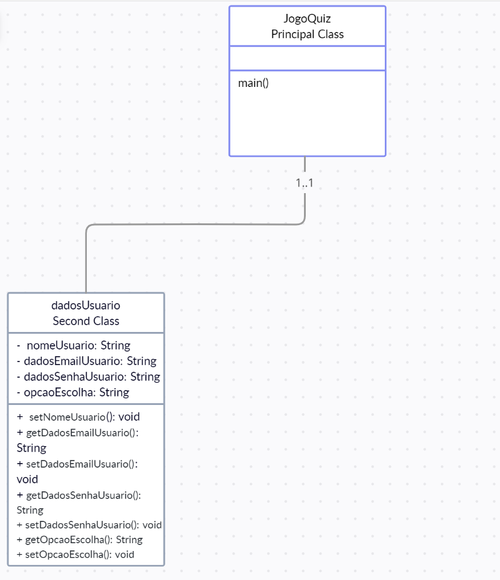

# Quiz Interativo - Perguntas e Respostas

🏆 <b>Objetivo do jogo:</b> Responder as perguntas propostas ao decorrer do Quiz Interativo. 
 
A medida que o jogador acertar uma questão, sua pontuação irá aumentar. Caso erre alguma pergunta, perderá ponto.  
 
🔍 <b>Observação:</b> No final do jogo, o usuário consegue visualizar sua pontuação total em relação aos seus acertos no final da rodada do quiz. 
 

ℹ️ <b>Informações sobre o quiz</b>

🇧🇷 <b>Tema do jogo:</b> Política Brasileira e Atualidades 

❓ <b>Quantidade de questões:</b> 10

☕ <b>Linguagem de programação utilizada:</b> Java 

🖥️ <b>IDE utilizada para implementação do código:</b> Netbeans e VSCode

📝 <b>Diagrama de classes do projeto</b>

👥 <b>Integrantes da equipe</b>
 
<li>Maria de Fátima</li>
<li>Anderson</li>
<li>João Pedro Moura</li>
<li>Renan Pedrosa</li>

2022 - Projeto de Programação

